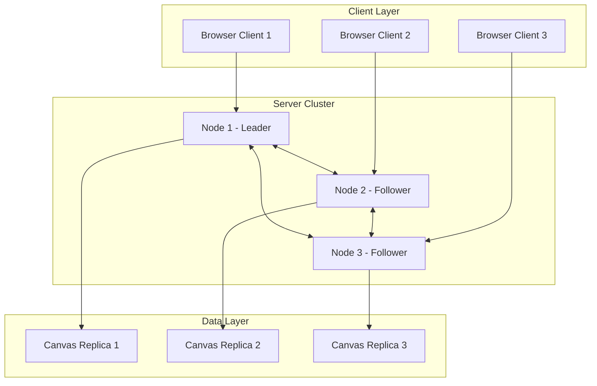

# distri-place: Distributed Collaborative Canvas

## Team Members

- Viljami Ranta
- Antti Ollikkala

## Project Description:

distri-place is a distributed collaborative pixel canvas system inspired by Reddit's r/place. Users place colored pixels on a shared canvas, with the system maintaining consistency across multiple server nodes. The system implements shared state through replicated canvas storage, synchronization via vector clocks, consensus using leader election with two-phase commit, and fault tolerance through heartbeat monitoring and state recovery.

## System Architecture



## Solution Techniques

### Canvas Partitioning

- **Prototype:** Full replication - each node stores complete 100×100 canvas
- **Large-scale:** Consistent hashing partitions 10,000×10,000 canvas into shards (1000×1000 each)
- Each shard replicated 3× across different nodes

### Consistency & Synchronization

- **Vector clocks** track causality: each update has `[V₁, V₂, V₃]` showing logical time per node
- **Conflict resolution:** Last-Write-Wins using timestamps, node ID as tie-breaker
- **Gossip protocol:** Nodes exchange state hashes every 5 seconds, synchronize differences

### Consensus

- **Leader election** using Bully algorithm (highest node ID becomes leader)
- **Two-phase commit** for pixel update batches:
  - Leader proposes batch every 100ms
  - Followers vote to accept
  - Leader commits if majority agrees

### Fault Tolerance

- **Heartbeats:** TCP keepalive every 2s between all nodes
- **Failure detection:** 6s timeout marks node as failed
- **Recovery:** Rejoining node requests full state from any active peer

## Node Roles and Functionalities

### Leader Node

- Coordinates pixel update commits via 2PC
- Aggregates updates from followers
- Initiates state synchronization rounds
- Handles leader election when elected

### Follower Nodes

- Accept client pixel placement requests
- Forward updates to leader for coordination
- Vote on commit proposals
- Monitor leader health, trigger re-election on failure

### All Nodes (Common)

- Maintain full canvas replica in memory
- Serve HTTP API for client requests (GET /canvas, POST /pixel)
- Send/receive peer-to-peer messages via TCP sockets
- Log all operations to local file
- Participate in gossip protocol for state convergence

**Prototype Setup:** 3 nodes, one elected as leader, all can accept client requests.

**Large-scale:** Regional clusters (3-9 nodes each), one leader per region, cross-region gossip.

## Message Protocol

### Client ↔ Server (Websocket and HTTP/JSON)

- Place a pixel - POST /pixel

```json
{
  "x": 50,
  "y": 30,
  "color": "#FF5733"
}
```

- Get the canvas - GET /canvas

```json
{
  "pixels": {"50,30": "#FF5733", ...},
  "version": [12, 8, 15]
}
```

- Real-time Pixel Update (WebSocket)

### Server ↔ Server (TCP/JSON)

**Pixel Update Broadcast:**

```json
{
  "type": "PIXEL_UPDATE",
  "x": 50,
  "y": 30,
  "color": "#FF5733",
  "timestamp": 1699123456.789,
  "vector_clock": [5, 3, 8],
  "node_id": 2
}
```

**Heartbeat:**

```json
{
  "type": "HEARTBEAT",
  "node_id": 2,
  "timestamp": 1699123456.789,
  "status": "healthy"
}
```

**Consensus - Prepare Phase:**

```json
{
  "type": "PREPARE",
  "proposal_id": 42,
  "batch": [
    { "x": 10, "y": 20, "color": "#00FF00", "timestamp": 1699123456.789 }
  ]
}
```

**Consensus - Vote:**

```json
{
  "type": "VOTE",
  "proposal_id": 42,
  "node_id": 3,
  "accept": true
}
```

**Consensus - Commit:**

```json
{
  "type": "COMMIT",
  "proposal_id": 42
}
```

**State Sync Request:**

```json
{
  "type": "SYNC_REQUEST",
  "state_hash": "a3f5c8...",
  "my_version": [10, 8, 12]
}
```

**State Sync Response:**

```json
{
  "type": "SYNC_RESPONSE",
  "missing_updates": [
    { "x": 15, "y": 25, "color": "#0000FF", "vector_clock": [11, 8, 12] }
  ]
}
```

**Leader Election:**

```json
{
  "type": "ELECTION",
  "node_id": 3,
  "priority": 3
}
```

```json
{
  "type": "COORDINATOR",
  "node_id": 3
}
```

---

## Scalability Discussion

**Current Prototype:** 3 nodes, ~100 req/s, full replication

**Large-Scale Target (1000+ nodes, 1M+ concurrent users):**

- **Sharding:** Canvas partitioned into 100 shards (1000×1000 pixels each)
- **Replication:** Each shard stored on 3 nodes for fault tolerance
- **Load Balancing:** DNS round-robin + regional routing
- **Caching:** Edge CDN for GET requests, reduces backend load by 90%
- **Write Throughput:** ~100K pixels/sec with batching and pipelining
- **Latency:** <100ms global writes via regional consensus + async cross-region sync

**Bottlenecks:** Leader node bandwidth, gossip convergence time, cross-region latency

**Solutions:** Multi-Paxos for batch commits, delta-based state sync, hierarchical gossip topology
